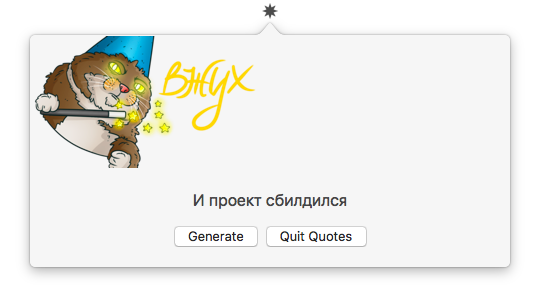

# Quotes

Quotes is a simple macOS app with quotes generation.

One to two paragraph statement about your product and what it does.

## Requirements

- macOS 10.12+
- Xcode 9.0+

## Installation

Clone and just run.

## Usage

Click "Generate" to present a new quote.

## Authors

* Artem Novichkov, novichkoff93@gmail.com

## License

Quotes is available under the MIT license. See the LICENSE file for more info.
